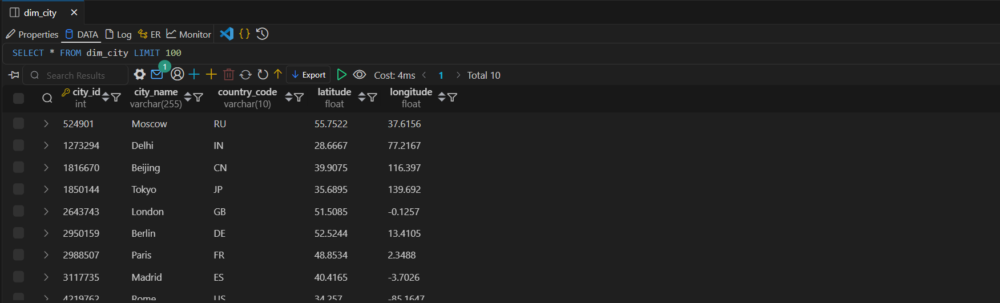

# Data_Warehousing

A comprehensive project for building, managing, and automating data warehouse solutions using Python, Apache Airflow, and Docker Compose. This repository demonstrates ETL pipelines, dimensional modeling (star and snowflake schemas), API data extraction, transformation, and loading into both MySQL and Snowflake data warehouses. The project is designed for extensibility, automation, and best practices in analytics and reporting.

---

## Features

- **Automated ETL Pipelines**: Extraction, transformation, and loading of weather data using Airflow DAGs.
- **Star & Snowflake Schema Modeling**: Scripts and workflows for both star and snowflake dimensional models.
- **API Integration**: Extracts weather data for multiple cities using the OpenWeatherMap API.
- **Data Transformation**: Cleans and structures raw API data for analytics.
- **Workflow Automation**: Uses Airflow sensors and operators for robust, scheduled workflows.
- **Slack Notifications**: Sends Slack alerts on DAG success or failure.
- **Extensible Design**: Easily add new data sources, schemas, or transformations.
- **Dockerized Environment**: All components run in isolated containers for easy setup and reproducibility.

---

## Project Structure

```
data Warehousing/
│
├── dags/
│   ├── star_schema_dag.py         # Airflow DAG for Star Schema ETL workflow
│   └── snowflake_schema_dag.py    # Airflow DAG for Snowflake Schema ETL workflow (coming soon)
│
├── data/
│   └── weather_data.json          # Extracted weather data
│
├── scripts/
│   └── star_schema/
│       ├── process_data.py        # Data transformation functions
│       └── ddl_scripts.py         # DDL scripts for schema creation
│
├── Dockerfile.airflow             
├── docker-compose.yml             # Docker Compose setup for Airflow, MySQL, etc.
├── requirements.txt               # Python dependencies
├── README.md                      # Project documentation
```

---

## How It Works

1. **API Availability Check**: Uses Airflow's `HttpSensor` to ensure the weather API is available.
2. **Data Extraction**: Extracts weather data for 10 cities and saves it as JSON.
3. **Data Transformation**: Processes raw data into city, date, and weather fact tables.
4. **Schema Creation**: Drops and recreates tables in MySQL (and Snowflake, if configured) using DDL scripts.
5. **Data Loading**: Loads transformed data into the data warehouse.
6. **Notifications**: Sends Slack messages on workflow success or failure.

---

## Requirements

- Docker & Docker Compose
- (Optional) Local installation of Python 3.8+ if running scripts outside containers

---

## Setup (with Docker Compose)

1. **Clone the repository**
   ```
   git clone https://github.com/logarajeshwaran/Data_Warehousing.git
   cd Data_Warehousing
   ```

2. **Start the stack**
   ```
   docker-compose up --build
   ```

   This will start Airflow (webserver, scheduler, worker), MySQL, and any other required services.

3. **Access Airflow UI**
   - Open [http://localhost:8080](http://localhost:8080) in your browser.
   - Default credentials: `airflow` / `airflow` (unless changed in `.env`).

4. **Set Airflow Variables and Connections**
   - Use the Airflow UI to add:
     - HTTP connection for the weather API (`weather_api_connection`)
     - MySQL connection (`mysql_default`)
     - Slack webhook connection (`slack_connection`)
     - (Optional) Snowflake connection (`snowflake_default`)
   - Set the `API_KEY` variable for OpenWeatherMap.

5. **Trigger the DAG**
   - Use the Airflow UI to trigger `star_schema_dag` or `snowflake_schema_dag` (when available).

---

## Customization

- **Cities**: Edit the list of cities in the extraction task.
- **Schema**: Modify `ddl_scripts.py` for custom table structures.
- **Notifications**: Update Slack channel or message formatting as needed.
- **Add New DAGs**: Place new DAG files in the `dags/` directory.

---

## Star Schema Output

Below are sample output images and visualizations generated from the Star Schema ETL workflow:

### Airflow DAG Overview


### Slack Notification  


### Dimension City Table




### Dimension Date Table


### Fact Weather Table


---

## Troubleshooting

- If you change database passwords or environment variables, remove volumes to reset data:
  ```sh
  docker-compose down -v
  docker-compose up -d
  ```
- Check logs in the `logs/` directory or via Docker:
  ```sh
  docker-compose logs <service>
  ```

---

## License

This project is licensed under the MIT License.

---

**Developed for educational and demonstration purposes.**